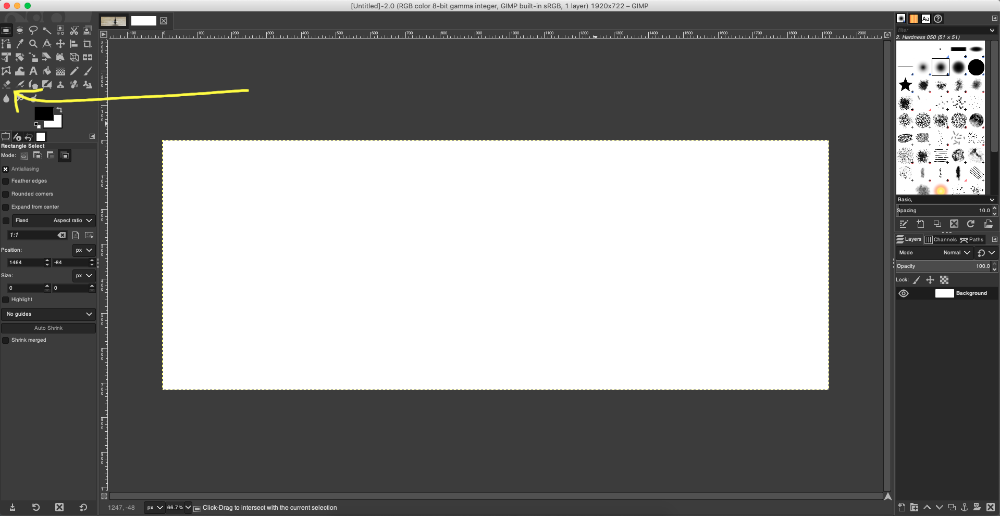
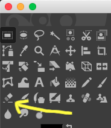
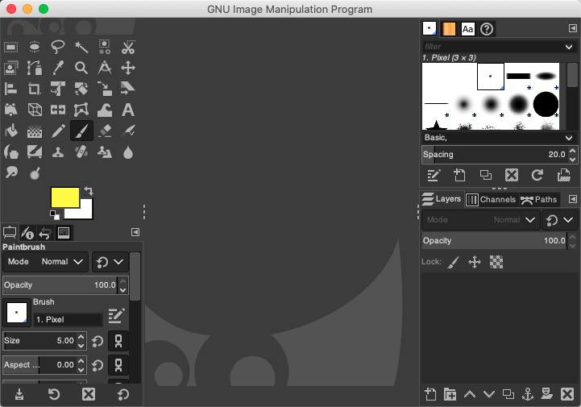
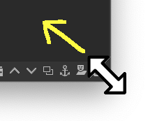

# How to capture good screenshots

Tips for capturing good (and readable) screenshots.

## Tip 1: Capture just what you need!

Sometimes capturing the entire screen is not needed, so take just what is needed. 

E.g.: Consider a tutorial talking about the "Eraser Tool" of the Gimp Image Editor. Capturing just the toolset is better than the entire screen.

**Bad**:

 

**Good**: 

 

## Tip 2: Resize window before capture!

When an entire window must be captured prefer to reduce window size to generate a smaller image. E.g.: resize window to the minimum size which covers the functions yout want to show, then take a screenshot.

**Bad**:

 

**Good**: 

 

On most operating systems windows can be resized by clicking and dragging lower corners:

 

