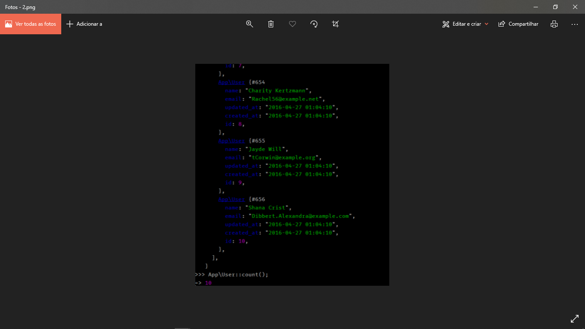

# Tinker

Mess with the data in your Laravel apps with Php Artisan Tinker.

* It is an interactive laravel console, a PHP terminal with access to the classes of our project.
* Tinker is a less-used feature of laravel, which quickly reads data from our app. We can use the laravel php artisan tinker built-in to tinker with the application and other things in the Database.
* It allows us to interact with our applications and stop dd () and die () from entering all the time. Many of us know the madness that occurs when there is print_r () and dd () in all of our code.

### **To Test**
In the terminal, type:
````bash
laravel new ScotchTest
````
For those without the Laravel installer on the computer, you can still use COMPOSER Laravel to create a project:
````bash
composer create-project laravel/laravel ScotchTest –prefer-dist
````

### **Configure Database**
Performing migrations. Create a database for the project and configure the migrations. Also configure .env with the created database.
* At the root of the project, run:
````bash
php artisan migrate
````
* At the root of the Laravel project, execute the following command:
````bash
php artisan tinker
````

* This command opens a repl to interact with your Laravel application. First, let's migrate our database. While repl are in, we can run our model factory and propagate our database.
````
factory(App\User::class, 10)→create();
````

* A collection of ten new users should appear on your terminal. Then, we can check the database to see if the users were actually created.
````
App\User::all();
````

* To get the total number of users in our database, we can just call User User model.
````
App\User::count();
````

* After running **App\User::all()** and **App\User::count()**, mine looks like this. You should get something similar to my only difference, the data being generated.


* 
From repl, we can create a new user. You should note that we interact with this in the same way that you would write code in your laravel application. So, to create a new user, we would do:
````
$user = new App\User;
$user->name = "Wruce Bayne";
$user->email = "iambatman@savegotham.com";
$user→save();
````
* Now we can type $user in the repl and get something like this.


* To delete a user, we can just do:
````
$user = App\User::find(1);
$user->delete();
````